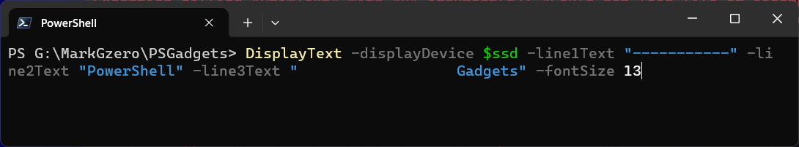
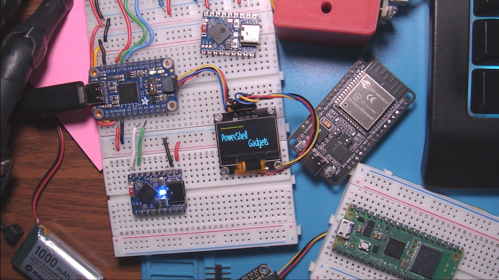
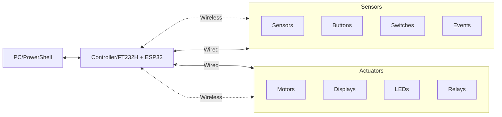
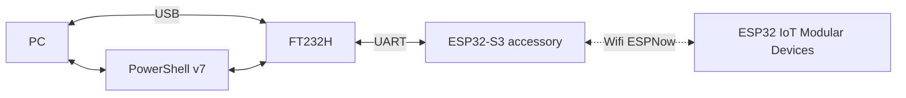
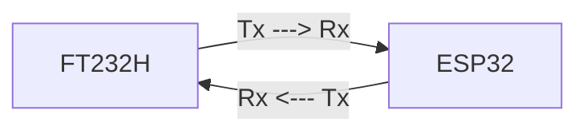

# PowerShell Gadgets





https://learn.adafruit.com/adafruit-ft232h-breakout?view=all

## Project Overview

This project is a proof of concept to demonstrate how to use a FTDI FT232H board to communicate with an ESP32 (ESP32-S3 pictured) board.  

This project requires knowledge of `PowerShell`, `MicroPython`, and `C#` programming languages.  

The FT232H board will be connected to a PC via USB and the ESP32 board will be connected to the FT232H board via serial UART.  

The ESP32 board will be used as an accessory board to handle WiFi/ESP-Now wireless communication with other ESP32 IoT devices.

## Objective

My ultimate objective is to a create a PowerShell-friendly modular physical device ecosystem for a variety of applications. 

Ideally, modules can be easily swapped out and reconfigured to create new devices. 

Code should be easily shared and reused across different devices.




### Requirements
------------------

### PowerShell v7

PowerShellv7 is required because the .NET libraries relevant to this project are not compatible with PowerShellv5.1, despite how much I want this project to be backwards compatible.  

#### Software

| Software | Description | 
| --- | --- |
| PowerShell v7 | PowerShell v7 is required because the .NET libraries relevant to this project are not compatible with PowerShell v5.1. | 
| VS Code | VS Code is a lightweight code editor that is ideal for developing PowerShell scripts. |
| Visual Studio | Visual Studio is a powerful IDE that is ideal for developing .NET applications. |
| .NET8 | .NET 5.0 or later is required to run the .NET libraries for the FTDI FT232H board. We'll be using .NET 8.0 because it's the latest and greatest. |

Getting latest version of the required software is easy with the Windows Package Manager `winget`.  

Here are the commands to install the required software:

```PowerShell
winget install Microsoft.PowerShell
winget install Microsoft.VisualStudioCode
winget install Microsoft.VisualStudio.2022.Community
winget install Microsoft.DotNet.SDK.8
```
--------------- 

#### Hardware

These are the boards and components I had to work with.  You can use any ESP32 board that supports WiFi/ESP-Now communication. 

**Basic kit.**  Should have everything you need to get started.

| Hardware | Cost/Each | Description | Cost/Total |
| --- | --- | -- | --- |
| [Adafruit FTDI FT232H](http://adafru.it/2264) | ~$14.95 | The Adafruit FT232H is a USB to serial UART interface board that can be used to communicate with a variety of devices. Get 3, in case one fails. | ~$44.85 |
| [ESP32 Starter Kit](https://www.amazon.com/SunFounder-Compatiple-Beginners-Engineers-ESP32-WROOM-32E/dp/B0CLDJ2DL7/ref=sr_1_3?sr=8-3) | ~$60.00 | ESP32 Starter Kit with a variety of components. | ~$60.00 |
| [Aitek ESP32-WROOM-32](https://www.amazon.com/ESP-WROOM-32-Development-Microcontroller-Integrated-Compatible/dp/B08D5ZD528/ref=sr_1_fkmr1_1?sr=8-1-fkmr1) | ~$5.00 | The Aitek ESP32-WROOM-32 is a small form factor ESP32 board that can be used for a variety of IoT applications, can be purchased in packs. |  ~$15.00 |
| [SSD1306 OLED Display](https://www.amazon.com/s?k=ssd1306) | ~$4.00 | Common OLED display |  ~$12.00 |
| Total | | | ~$131.85 |

**Optional** Extra boards and components.  Small form factor boards and a soldering kit.

| Hardware | Cost | Description | Costx3 |
| --- | --- | -- | --- |
| [WaveShare ESP32-S3](https://www.waveshare.com/esp32-s3-dev-board.htm) | ~$9.00 | The WaveShare ESP32-S3 is a small form factor ESP32 board that can be used for a variety of IoT applications. | ~$27.00 |
| [Adafruit QTPy ESP32](https://www.adafruit.com/search?q=qt+py) | ~$13 | The Adafruit QTPy ESP32 boards are small form factor boards that can be used for a variety of IoT applications. | ~$39.00 |
| Soldering Kit | ~$50.00 | Basic soldering kit with soldering iron, solder, and other accessories. | ~$50.00 |
| Total | | | ~$116.00 |

Any ESP32-based boards can be used as an accessory board to handle WiFi/ESP-Now communication with other ESP32 IoT devices. I just happen to choose the ESP32-S3 board because it's tiny.

_Note: ESP32-S2 and ESP8266 boards do not support Bluetooth Low Energy (BLE) communication, which can limit the functionality of some IoT applications. Just FYI._


## .NET library for FTDI FT232H

The [.NET IoT Libraries](https://github.com/dotnet/iot) enable robust IoT application development in .NET, providing essential support for hardware interfacing, communication protocols, and cross-platform functionality. These libraries offer versatile bindings for a range of IoT hardware, including displays, sensors, and peripherals, and can integrate seamlessly with SkiaSharp for graphical output on displays, allowing for sophisticated UI rendering. Integration with other .NET frameworks, such as ASP.NET Core, facilitates web-based or cloud-connected solutions.

- Device bindings for sensors, displays, and peripherals
- GPIO, SPI, and I2C support for direct hardware communication
- Core APIs for GPIO management, including pin operations and interrupts
- Support for UART, PWM, and other communication protocols
- SkiaSharp support for high-quality UI rendering on displays
- Integration with ASP.NET Core and .NET for cloud-connected IoT solutions

[Iot.Device.Bindings](https://github.com/dotnet/iot)

## Wireless Communication via ESPNow

ESP-Now is a connectionless communication protocol developed by Espressif Systems that allows for low-power communication between ESP32 boards.  ESP-Now is ideal for IoT applications that require low latency and low power consumption.

Additionally, ESP-Now does not require the use of an access point or router, making it ideal for peer-to-peer communication between ESP32 boards.

## Project Diagram

The following diagram shows the components and connections for this project.  The FT232H board is connected to the PC via USB and the ESP32 board is connected to the FT232H board via serial UART.  The ESP32 board is used as an accessory board to handle WiFi/ESP-Now wireless communication with other ESP32 IoT devices.



## Serial UART

The FT232H board is connected to the PC via standard USB.

Out of the box the FT232H is configured to act just like a USB to serial UART converter. This is great for talking to an accessory board like the Waveshare ESP32-S3 development board. This enables the possibility of using the ESP32 board's Wifi and BLE features. Of interest is the ESP-Now feature that allows for low power communication between ESP32 boards. This means we can use the ESP32-S3 board to wirelessly communicate with other ESP32 boards.

The ESP32-S3 board has a built-in USB to serial UART converter, but we'll use the FT232H for the UART connection to the ESP32-S3 board.

However, the Iot.Device library does not support the ESP32-S3 board, so we'll need to use the ESP32-S3 board as an accessory board to handle the WiFi/ESP-Now communication.


### UART Pins


| UART | FT232 Pin | ESP32-S3 Pin |
| --- | --- | --- |
| TX | D0 | 6 |
| RX | D1 | 5 |


The most important and pins are D0 and D1 for the TX and RX pins.  FT232H Rx/Tx pins are baked-in and cannot be changed.  The ESP32-S3 board has a few UART pins to choose from, but for this project we'll use pins 5 and 6.  

**D0** - TX or transmit pin.  This pin is the serial data output by the FT232H chip and should be connected to the RX or receive pin of a serial device.

**D1** - RX or receive pin.  This pin is the serial data input for the FT232H chip and should be connected to the TX or transmist pin of a serial device.

### UART Connection Loop

It's important that the TX pin of the FT232H is connected to the RX pin of the ESP32 accessory board and vice versa.  



### What about SPI or I2C ?

Unfortunately, ESP32 does not reliably support I2C "slave" mode, therefore it's not possible to interface with the FT232H in I2C mode.  

The ESP32 does support SPI, but working with the FT232H Multi-Protocol Synchronous Serial Engine, or MPSSE, is complex and not worth the effort for the scope of this project.

More importantly, the FT232H can not use UART and another protocol at the same time. This is a limitation of the FT232H chip. It may be necassary to use multiple FT232H boards to handle multiple protocols, actions, and devices simultaneously.

# What about other projects? 

## PowerShell-IoT by Microsoft

This is my main inspiration for this project. This repository has been archived by the owner on Jun 13, 2024. 

https://github.com/PowerShell/PowerShell-IoT

## MPSSELight by zhelnio

Looks interesting. Will need to circle back to this later and see if it's useful for this project. 

https://github.com/zhelnio/MPSSELight/tree/master

## FtdiSharp by swharden

I keep finding this guy when I'm looking for FTDI libraries. :D 

FtdiSharp is a .NET interface for FTDI USB controllers that provides high-level tools for advanced communication protocols (I²C, SPI, and GPIO) and also supplies a copy of FTDI's official DLL wrapper to provide low-level control for advanced users.

https://www.nuget.org/packages/FtdiSharp/0.0.3-alpha 

other swharden projects
https://www.nuget.org/profiles/swharden

## FTD2XXHelper by KoKoHomask

Appears to be helper C# code for the FTDI D2XX library, which then exposes the API pointers for easier use in C#. 

https://github.com/KoKoHomask/FTD2XXHelper


