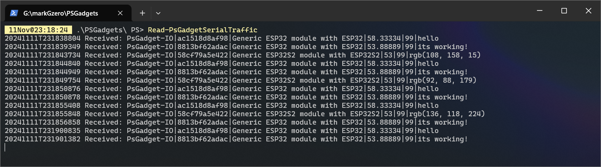
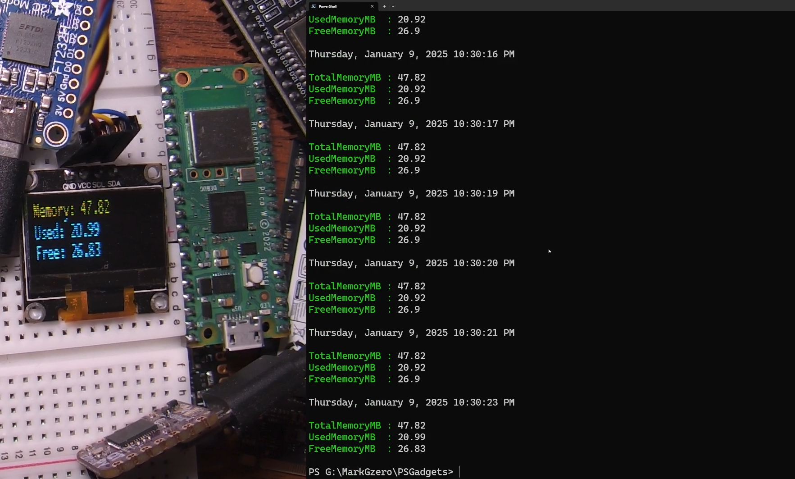

# PowerShell Gadget (PsGadget)

## DISCLAIMER: I'm literally learning IoT concepts and tinkering with microcontroller + PowerShell stuff for the first time as I mess with this stuff. Check back every few weeks if you're interested in seeing how this project evolves. 


## Project Overview

This project is an experimental exploration to see how much fun I can have with PowerShell and microcontrollers. 

As a system administrator, I often find myself needing to monitor multiple assets. While there are various monitoring solutions available, I want to see if I can create something that's modular, flexible, and most importantly, fun.

## Wireless

To expand the capabilities of this project, wireless communication is necessary. Since the FT232H chip does not natively support wireless communication, we'll use an ESP32, like the WaveShare ESP32-S3 board, to handle WiFi and ESP-Now communication with peripheral modules and devices. 

ESP-Now is particularly useful for low-power, low-latency communication between devices. It allows multiple devices to communicate with each other without the need for a traditional Wi-Fi network, making it ideal for IoT applications. It also support encryption, which is an important feature for secure communication in IoT devices.

## Wiring 

The ESP32 is connected to the FT232H board via UART (Universal Asynchronous Receiver-Transmitter) serial communication pins.

Below is an example of how to connect the FT232H board to the ESP32 board:


## Compatibility with PowerShell 5.1 and 7.x

For interesting and useful projects, we'll want control over the FT232H GPIO pins. 

Drivers are available here: https://ftdichip.com/drivers/vcp-drivers/

The FTDI driver allows us to use the FT232H chip in two different modes: Virtual COM Port (VCP) mode and a proprietary D2XX mode.


According to the official [FTDI Programming Guide](https://ftdichip.com/wp-content/uploads/2023/09/D2XX_Programmers_Guide.pdf):

> FTDI provides two alternative software interfaces for its range of USB-UART and USB-FIFO ICs. One
interface provides a Virtual COM Port (VCP) which appears to the system as a legacy COM port. The
second interface, D2XX, is provided via a proprietary DLL (FTD2XX.DLL). The D2XX interface provides
special functions that are not available in standard operating system COM port APIs, such as setting the
device into a different mode or writing data into the device EEPROM.


### VCP vs MPSSE

#### Virtual COM Port (VCP) mode

In VCP mode, the FT232H acts like a standard serial port, which is great for sending and receiving data but doesn't allow direct control of the GPIO pins. 

#### MPSSE mode

In MPSSE mode, we can control the GPIO pins directly, but we lose the ability to use the FT232H as a serial port.

## Libraries

So far I've found three official libraries that allows interacting with an Adafruit FT232H breakout board. 

<!-- HTML table with two columns -->
<table>
<tr>
    <th>Library</th>
    <th>Notes</th> 
</tr>
<tr>
    <td>
    FTD2XX_NET<br>
    - ftd2xx_NET.dll
    </td>
    <td>
    - Compatible with PowerShell 5.1 and 7.x. <br>
    - Requires only a single DLL file. <br>
    - Allows control of GPIO pins using MPSSE Bit-Bang mode. <br>
    - WIth FTDI driver, either VCP or MPSSE (for GPIO control) can be used, but not both at the same time. <br>
    </td>
</tr>

<tr>
    <td>.NET IoT libraries <br>
     - System.Device.Gpio.dll  <br>
     - IoT.Device.Bindings
     </td>
    <td>
    - Compatible only with .NET 6.0 and later. <br>
    - Both DLL files must be loaded in the session. <br>
    - Uses System.Device.GPIO for GPIO control, which includes PWM support. <br>
    - GPIO can be used even if Virtual COM Port (VCP) is running. <br>
    - Slightly easier to use than FTD2XX_NET.dll due to project documentation. <br>
    - Allows use of OLED displays using I2C.
    </td>
</tr>
</table>

### Links 

#### FTDI FTD2XX_NET
Nuget [FTD2XX_NET](https://www.nuget.org/packages/FTD2XX.Net)  
Project site: https://ftdichip.com/software-examples/code-examples/csharp-examples/

#### .NET IoT libraries
Nuget [System.Device.Gpio](https://www.nuget.org/packages/System.Device.Gpio)  
Nuget [IoT.Device.Bindings](https://www.nuget.org/packages/Iot.Device.Bindings)  
Project site: https://github.com/dotnet/iot

## FTDI tagging and labeling

Recently discovered that we can use the FT_Prog utility to tag and label FTDI devices. This is a game changer IMO because I have a bunch of FTDI devices and I can never remember which one is which. 

By tagging and labeling FTDI device EEPROM, we can categorize and differentiate devices by their device string descriptions and serial number prefixes. This allows us to interact with PSGadget devices in a PowerShell script without hardcoding the serial number of each device.

See also: [CategorizingFT232-Devices.md](./docs/CategorizingFT232-Devices.md)

# Examples

## Example: PowerShell 5.1; Reading serial port stream from multiple wireless psgadget-io devices 



## Example: PowerShell 7.x; Monitoring memory usage info then displaying results on an SSD1306 OLED display

Demo file: `./examples/psgadget_demo.ps1`

```powershell
function Get-MemoryInfo {
    [cmdletbinding()]
    param ()
    $memory = Get-CimInstance -ClassName Win32_OperatingSystem
    $totalMemory = [math]::Round($memory.TotalVisibleMemorySize / 1MB, 2)
    $freeMemory = [math]::Round($memory.FreePhysicalMemory / 1MB, 2)
    $usedMemory = [math]::Round($totalMemory - $freeMemory, 2)
    [PSCustomObject]@{
        TotalMemoryMB = $totalMemory
        UsedMemoryMB = $usedMemory
        FreeMemoryMB = $freeMemory
    }
}

while(1){
    $meminfo = Get-MemoryInfo -Verbose:$false
    (Get-Date).DateTime
    $meminfo
    Display-Text -displayDevice $ssd -Header "Memory: $($meminfo.TotalMemoryMB)" -Body "Used: $($meminfo.UsedMemoryMB)`nFree: $($meminfo.FreeMemoryMB)"
    Start-Sleep -Seconds 1
}
```


## Updates

2024OCT23: Initial commit.

2024NOV02: Learned about FT_Prog utility to tag and label FTDI devices. Updated documentation to reflect this new information. [CategorizingFT232-Devices.md](./docs/CategorizingFT232-Devices.md)

2025JAN09: Revisited displaying text on an SSD1306 OLED display. Cleaned up the function so its easier to use and lines can be separated by newline character, or automatically wrapping text based on character count. Found that font Lucinda Console works best for this display.
