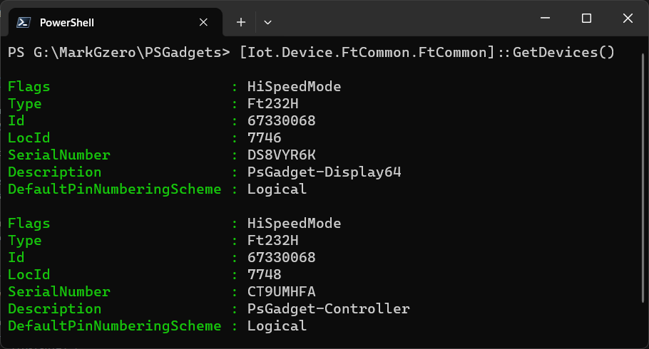
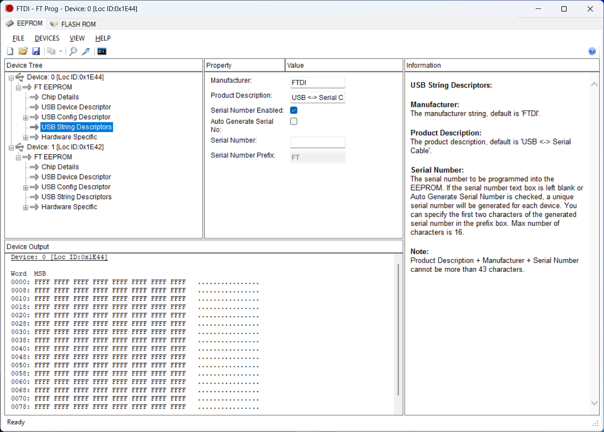

# Categorizing FT232-based PSGadgets

## Introduction

We have a small problem. With FT232H chips in default configuration, we can really only meaningfully differentiate between devices by the serial number. This makes it challenging to identify and interact with PSGadget devices using a PowerShell script without hardcoding the serial number of each device. 


Instead we want something like this:



## FT_Prog Utility

Fortunately, FTDI's FT_Prog allows device string descriptions and serial number prefixes customization. We can then update the chip EEPROM (Electrically Erasable Programmable Read-Only Memory) with the new values.



⚠️Note: Product Description + Manufacturer + Serial Number cannot be more than 43 characters.

By categorizing FT232-based PSGadget devices using custom device string descriptions and serial number prefixes, it's possible to automatically differentiate and interact with PSGadget devices in a PowerShell script.

For example, the following table shows a list of device string descriptions and serial number prefixes that could be used to categorize PSGadget devices:

_Manufacturer: FTDI_  
_Serial Number Enabled: True_  
_Auto Generate Serial Number: True_

| String Description | Serial Number Prefix | Category |
|--------------------|----------------------|----------|
| USB <-> Serial Cable |  |(Default) |
| PsGadget-Controller | CT | PSGadget Controller Device |
| PsGadget-Display64 | DS | PSGadget Display Device SSD1306 128x64 |
| PsGadget-Display32 | DS | PSGadget Display Device SSD1306 128x32 |
| PsGadget-IO | IO | PSGadget IO Device |
| PsGadget-Input | IN | PSGadget Input Device |
| PsGadget-Output | OT | PSGadget Output Device |
| PSGadget-DCMotor | DC | PSGadget DC Motor Device |
| PSGadget-Servo | SV | PSGadget Servo Device |
| PSGadget-Stepper | SP | PSGadget Stepper Device |
| PSGadget-Solenoid | SL | PSGadget Solenoid Device |
| PSGadget-Relay | RL | PSGadget Relay Device |
| PSGadget-LED | LD | PSGadget LED Device |
| PSGadget-HBridge | HB | PSGadget H-Bridge Device |

## Programming

To program the EEPROM of an FT232 device, follow these steps:

1. Plug in the FT232 device to the computer.

2. Open the FT_Prog utility.


3. Click on the "Scan and Parse" button to scan for connected devices.


4. If more than one, select the device from the list of devices.

5. Click USB String Descriptors from the Device Tree on the left side of the FT_Prog utility.


6. In the Property and Value section, enter the desired device string description and serial number prefix. Here we are setting the device string description to "PsGadget-Display64" and the serial number prefix to "DS".


7. Click on the "Program" button to program the EEPROM with the new values.


8. Click on the "Program" button again to confirm the programming.


The status text at the bottom-left corner of the FT_Prog utility should show "Programmed Successfully" if the programming was successful. 

Done. 


Comparing the new hexadecimal values with the previous values, we can see that the device string description and serial number prefix have been successfully programmed into the EEPROM.


## Example (PowerShell7)

We should now be able to detect the FT232 device with the custom device string description and serial number prefix in PowerShell7.

```powershell
# Load the required assemblies
Add-type -AssemblyName System.Drawing # Required for SkiaSharp graphics library

# Path to the PSGadgets library
$packagespath = "G:\MarkGzero\PSGadgets\lib" # 

# Load the libraries and dependencies
gci $packagespath\*.dll | % {
    try {
        [System.Reflection.Assembly]::LoadFrom($_.FullName)
    } catch {
        Write-Host "Error loading assembly: $_"
    }
} 

# Get list of FTDI devices
$devices = [Iot.Device.FtCommon.FtCommon]::GetDevices()
```

If successful, you should see the device string description and serial number prefix in the output.

:information_source: May need to disconnect and reconnect the device to see the changes.

We can also use the `Get-PNPDevice` cmdlet to get the device information.

```powershell
> Get-pnpdevice | ? Manufacturer -match FTDI | ? Status -eq OK | select PNPClass,PNPDeviceID

PNPClass PNPDeviceID
-------- -----------
Ports    FTDIBUS\VID_0403+PID_6014+DS9XBVNRA\0000
USB      USB\VID_0403&PID_6014\DS9XBVNR
```

We can see that the Serial Number Prefix "DS" is part of the PNPDeviceID. 

If the Virtual COM Port is enabled, you can also see the device serial prefix in the COM port name.

## Erasing the EEPROM to default

In case you want to erase the EEPROM to default, you can use the FT_Prog utility to erase the EEPROM and restore the default settings.

## Removing FTDI PNP Devices

Programming the EEPROM with the custom serial number prefix will create a new PNP device. PNP devices can get cluttered over time. We may need to remove unwanted devices to keep the list clean.

We can use the `pnputil` command-line utility to remove unwanted devices. Admin privileges are required to remove devices.


```powershell
# Get devices with the manufacturer 'FTDI' whose status is not 'OK' and remove them using pnputil
Get-PnpDevice | 
    Where-Object { $_.Manufacturer -match 'FTDI' -and $_.Status -ne 'OK' } | 
    ForEach-Object {
        $instanceId = $_.PNPDeviceID  # Ensure we are using the PNPDeviceID property
        pnputil.exe /remove-device "$instanceId"
    }
```

## Summary

FTDI's FT_Prog utility allows custom device string descriptions and serial number prefixes to be programmed into the EEPROM of FT232 devices.

By categorizing FT232-based PSGadget devices using custom device string descriptions and serial number prefixes, it's possible to automatically differentiate and interact with PSGadget devices in a PowerShell script.  