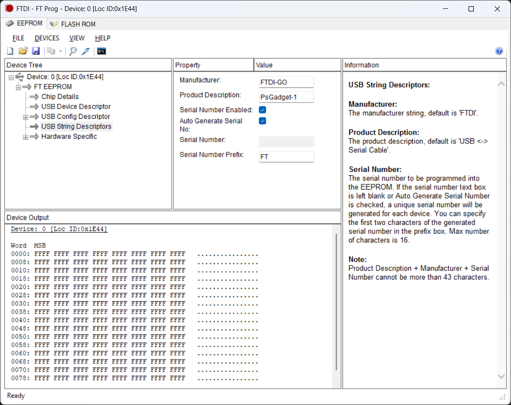

# Categorizing FT232 Devices

FTDI FT_Prog allows custom device string descriptions to be programmed into the EEPROM of an FT232 device. 

The EEPROM is the small memory chip on the FT232 device that stores the device's configuration settings. The EEPROM can be programmed using the FT_Prog utility, which is available from the FTDI website.



```
USB String Descriptors:
Manufacturer:
The manufacturer string, default is 'FTDI'.

Product Description:
The product description, default is 'USB <-> Serial Cable'.

Serial Number:
The serial number to be programmed into the EEPROM. If the serial number text box is left blank or Auto Generate Serial Number is checked, a unique serial number will be generated for each device. You can specify the first two characters of the generated serial number in the prefix box. Max number of characters is 16.

Note:
Product Description + Manufacturer + Serial Number cannot be more than 43 characters.
```

By carefully planning out the device string descriptions and serial number prefixes, we can categorize FT232-based devices in a way that enables auto-detection and interaction with PSGadget devices.

For example, the following table shows a list of device string descriptions and serial number prefixes that could be used to categorize PSGadget devices:


Manufacturer: FTDI-GO  
Serial Number Enabled: True  
Auto Generate Serial Number: True  

| String Description | Serial Number Prefix | Category |
|--------------------|----------------------|----------|
| USB <-> Serial Cable |  | USB <-> Serial Cable (Default) |
| PsGadget-Controller | CT | PSGadget Controller Device |
| PsGadget-Display64 | DS | PSGadget Display Device SSD1306 128x64 |
| PsGadget-Display32 | DS | PSGadget Display Device SSD1306 128x32 |
| PsGadget-IO | IO | PSGadget IO Device |
| PsGadget-Input | IN | PSGadget Input Device |
| PsGadget-Output | OT | PSGadget Output Device |
| PSGadget-DCMotor | DC | PSGadget DC Motor Device |
| PSGadget-Servo | SV | PSGadget Servo Device |
| PSGadget-Stepper | SP | PSGadget Stepper Device |
| PSGadget-Solenoid | SL | PSGadget Solenoid Device |
| PSGadget-Relay | RL | PSGadget Relay Device |
| PSGadget-LED | LD | PSGadget LED Device |
| PSGadget-HBridge | HB | PSGadget H-Bridge Device |

## Programming


For example, the device string description is set to "PsGadget-Display64" and the serial number prefix is set to "DS". This allows us to categorize the device as a PSGadget Display Device SSD1306 128x64.


## 

```powershell
# Load the required assemblies
Add-type -AssemblyName System.Drawing # Required for SkiaSharp
$packagespath = "G:\MarkGzero\PSGadgets\lib"
gci $packagespath\*.dll | % {
    try {
        [System.Reflection.Assembly]::LoadFrom($_.FullName)
    } catch {
        Write-Host "Error loading assembly: $_"
    }
} 
# Get the list of devices
$devices = [Iot.Device.FtCommon.FtCommon]::GetDevices()
```

```powershell
Flags                     : HiSpeedMode
Type                      : Ft232H
Id                        : 67330068
LocId                     : 7748
SerialNumber              : DS9TEY2B
Description               : PsGadget-Display
DefaultPinNumberingScheme : Logical
```


In the above example, the device string description is set to "PsGadget-Display64" and the serial number prefix is set to "DS". 
This allows us to categorize the device as a PSGadget Display Device with a 128x64 resolution.

## Erasing the EEPROM to default

In case you want to erase the EEPROM to default, you can use the FT_Prog utility to erase the EEPROM and restore the default settings.

